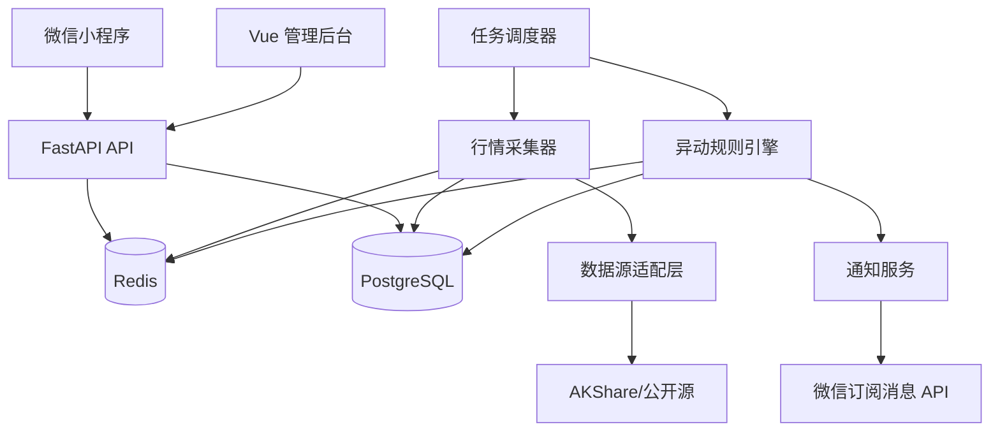

# 异动股票雷达小程序——产品与技术设计文档

> 文档版本：v0.4  
> 编制日期：2026-07-19  
> 产品阶段：内部 MVP  
> 产品名：异动雷达  
> 适用范围：上交所主板、深交所主板、创业板、科创板 A 股

## 1. 文档目的

本文档用于明确内部 MVP 的产品范围、交易规则口径、数据方案、系统架构、核心数据模型、接口、任务调度、告警、测试和交付计划。

MVP 的目标不是提供投资建议，而是根据交易所公开规则，尽可能及时地识别正向价格异常波动股票，并透明展示计算过程。

## 2. 产品目标

### 2.1 核心目标

1. 覆盖沪深主板、创业板和科创板。
2. 盘中每 10～15 秒计算一次“预计异动”。
3. 盘后根据正式收盘价生成“系统触发异动”。
4. 所有触发、计数和重置均以系统计算结果为准，不接入交易所公告确认流程。
5. 支持内部白名单用户、自选股和微信订阅消息提醒。
6. 数据源费用为零，接受公开数据源不稳定、无服务等级保证的限制。
7. 支持连续 10 个交易日累计偏离值达到 +100%，以及连续 30 个交易日累计偏离值达到 +200% 的正向严重异常波动识别。
8. 支持连续 10 个交易日内多次出现同正向三日异常波动的次数型严重异常规则。

### 2.2 非目标

MVP 暂不包含：

- 股票交易、模拟交易或券商账户连接。
- 买入、卖出、目标价、收益预测等投资建议。
- 负向异动。
- 换手率异常规则。
- 龙虎榜、新闻研判、题材分析和财务分析。
- 面向公众的商业化运营。
- 对免费行情数据进行二次销售或公开再分发。

## 3. 用户与场景

### 3.1 用户规模

- 内部用户：10～100 人。
- 用户进入方式：微信登录后，由管理员加入白名单。
- 用户角色：普通用户、管理员。

### 3.2 典型场景

1. 用户在交易时段打开首页，查看当前预计达到或接近异动阈值的股票。
2. 用户查看某只股票最近最多三个有效交易日的价格、指数和偏离值计算过程。
3. 用户把股票加入自选，并申请一次性微信订阅消息权限。
4. 股票达到预警条件时，系统发送一次订阅消息。
5. 收盘后，用户查看最终计算结果及是否已得到交易所公开信息确认。
6. 管理员检查数据采集任务、计算异常和数据质量问题。

## 4. 产品信息架构

### 4.1 小程序页面

| 页面 | 主要功能 |
|---|---|
| 登录/授权 | 微信登录、隐私提示、内部白名单校验 |
| 异动首页 | 三日异动、十日严重异动、三十日严重异动、数据更新时间、行情状态 |
| 股票详情 | 最新价、所属板块、基准指数、3/10/30 日累计偏离值、触发结果和计算明细 |
| 自选股 | 自选列表、预计偏离值、提醒状态 |
| 提醒设置 | 提醒阈值、正式触发提醒、微信订阅授权 |
| 历史异动 | 按日期、板块、确认状态筛选历史事件 |
| 我的 | 用户信息、免责声明、规则说明、数据源说明、备案信息 |

### 4.2 管理后台

| 模块 | 主要功能 |
|---|---|
| 数据源监控 | 最近成功时间、延迟、失败次数、数据条数 |
| 任务监控 | 实时抓取、盘后同步、规则计算、通知任务 |
| 异动事件 | 查看计算明细、人工确认、标记误报 |
| 计算复核 | 查看异常计算明细、数据质量问题和重算记录 |
| 股票主数据 | 板块、状态、上市日期、基准指数、排除标志 |
| 用户管理 | 白名单、角色、停用账号 |
| 通知日志 | 发送状态、微信返回码、防重复发送键 |
| 规则版本 | 查看生效时间、阈值、指数和计算方法 |

## 5. 交易规则口径

### 5.1 规则依据

MVP 按 2026 年 7 月 6 日起实施的沪深交易所现行规则设计：

- [上海证券交易所交易规则（2026年修订）](https://www.sse.com.cn/lawandrules/sselawsrules2025/trade/universal/c/c_20260424_10816492.shtml)
- [深圳证券交易所交易规则（2026年修订）](https://docs.static.szse.cn/www/lawrules/rule/trade/current/W020260424690713155663.pdf)

规则发生变更时，应新增规则版本，不覆盖历史版本。

### 5.2 板块与基准指数

| 板块 | 股票代码特征（仅作辅助） | 基准指数 | 指数代码 | 正向阈值 | 累计方法 |
|---|---|---|---|---:|---|
| 上交所主板 A 股 | 600/601/603/605 等 | 上证 A 股指数 | 000002 | +20% | 区间复合涨幅之差 |
| 深交所主板 A 股 | 000/001/002/003 等 | 深证 A 股指数 | 399107 | +20% | 区间复合涨幅之差 |
| 创业板 | 300/301 等 | 创业板综合指数 | 399102 | +30% | 区间复合涨幅之差 |
| 科创板 | 688/689 等 | 上证科创板 50 成份指数 | 000688 | +30% | 每日涨跌幅偏离值累计 |

股票所属市场和板块必须以主数据为准，不能只靠代码前缀判断。

### 5.3 累计偏离值公式

沪深主板和创业板在一个候选窗口内采用区间复合涨幅之差：

```text
股票区间涨幅 = (期末股票价格 / 期初前收盘价格 - 1) × 100%

指数区间涨幅 = (期末指数点位 / 期初前收盘点位 - 1) × 100%

累计偏离值 = 股票区间涨幅 - 指数区间涨幅
```

例如：

```text
某深市主板股票期初前收盘价 = 10.00
当前价或期末收盘价          = 12.10
同期深证 A 指区间涨幅        = -0.50%

股票区间涨幅 = 21.00%
累计偏离值   = 21.00% - (-0.50%) = 21.50%
结果         = 达到主板 +20% 阈值
```

科创板按现行规则分别计算每日收盘价格涨跌幅偏离值，再对窗口内的每日偏离值求和：

```text
科创板当日偏离值 = 科创板股票当日涨跌幅 - 科创50指数当日涨跌幅

科创板累计偏离值 = Σ 窗口内每日偏离值
```

因此规则引擎必须按规则版本选择计算策略，不能对所有板块使用同一个公式。盘中时，科创板当日股票涨跌幅和科创50当日涨跌幅均使用最新价/点位相对各自前收盘计算。

### 5.4 严重异常波动规则

MVP 实现数值型和次数型正向严重异常波动：

| 规则代码 | 计算窗口 | 触发条件 | 适用板块 |
|---|---:|---|---|
| `SEVERE_10D_100` | 连续 10 个交易日 | 累计偏离值达到 +100% | 沪深主板、创业板、科创板 |
| `SEVERE_30D_200` | 连续 30 个交易日 | 累计偏离值达到 +200% | 沪深主板、创业板、科创板 |
| `SEVERE_10D_REPEAT_4` | 连续 10 个交易日 | 4 次同正向三日异常波动 | 沪深主板 |
| `SEVERE_10D_REPEAT_3` | 连续 10 个交易日 | 3 次同正向三日异常波动 | 创业板、科创板 |

沪深主板和创业板沿用区间复合涨幅之差；科创板沿用每日偏离值累计。窗口按股票有效交易日和现行交易规则处理，达到阈值即触发，无需用户选择计算窗口。

次数型规则按三日正向异常事件计数：

- 盘中预测可以将当前正在形成的 `INTRADAY_PREDICTED` 三日事件计入“预计次数”，但只能显示预计严重异动。
- 盘后计算使用 `SYSTEM_TRIGGERED` 三日事件生成次数型严重异动结果。
- 同一个三日异动事件在窗口内只计数一次，不能因重复抓取或多条公司公告重复计数。
- 负向事件不计入本产品的正向次数型规则。

### 5.5 盘中计算

盘中使用最新价替代“期末收盘价”，其余计算口径与盘后一致。

盘中结果只能使用以下状态和文案：

- `APPROACHING`：接近异动阈值。
- `INTRADAY_PREDICTED`：按当前价预计达到异动阈值。
- 页面文案：“盘中预计；若以当前价格收盘，预计累计偏离值为 XX.XX%。”

不得在收盘前显示“交易所已确认异动”。

“接近异动”不再采用固定差值。系统按该股票当日涨停价计算其理论最大当日涨幅，并代入 3/10/30 日规则：

```text
当前尚未触发
且
若今日以涨停价收盘，至少一条规则能够达到阈值
=> APPROACHING
```

涨停价必须来自当日涨跌停价格数据或按交易所价格笼子及最小报价单位正确计算，不能简单使用 `前收盘价 × (1 + 10%/20%)` 后保留两位。无涨跌幅限制、停牌或缺少可靠涨停价的股票不计算“接近异动”。详情页展示“今日涨停时预计偏离值”和可能触发的规则类型。

### 5.6 盘后计算状态

事件状态：

```text
APPROACHING
  -> INTRADAY_PREDICTED
  -> SYSTEM_TRIGGERED

任一状态也可能进入 DATA_REVIEW_REQUIRED
```

- `SYSTEM_TRIGGERED`：使用正式收盘价计算达到阈值，作为本产品最终状态。
- `DATA_REVIEW_REQUIRED`：行情缺失、涨跌幅矛盾或数据源异常，需要人工检查。

产品统一使用“系统计算异动”“系统计算严重异动”等文案，不显示“交易所确认”或暗示结果已经得到交易所认定。

### 5.7 系统内部窗口计算

产品不提供窗口选择功能，只展示每条规则“是否触发”和当前累计偏离值。窗口完全由规则引擎内部确定。

三日异动规则在上一次重置生效日之后，对最近不超过三个有效交易日生成候选窗口：

- 最近 1 个交易日。
- 最近连续 2 个有效交易日。
- 最近连续 3 个有效交易日。

任一候选窗口达到对应板块阈值，即产生事件。这样可以覆盖两日内已达到阈值的实际情况。

“连续交易日”按交易日历计算；股票全天停牌日不作为该股票的有效计算日。窗口超过三个有效交易日仍未触发时，采用滚动窗口。

10 日和 30 日严重异常规则分别维护对应长度的滚动有效交易日窗口。详情页可以展示系统采用的起止日期用于解释，但用户不能修改。

### 5.8 重置规则

系统在盘后计算确认触发后，从下一有效交易日或复牌日起重置对应规则域。重置记录必须保存触发事件、计算时间、规则版本和数据源记录。

重置必须按规则域隔离：

- 三日异常波动公布只重置 `ABNORMAL_3D` 的计算起点。
- 10/30 日严重异常指标继续累计，不能因普通三日异动公布而清零。
- 系统确认严重异常波动后，从下一有效交易日或复牌日起重置严重异常指标。
- 10 日和 30 日规则是否共用严重异常重置点，由当前交易所规则版本配置决定。

这是一项产品化近似：现行交易规则以交易所公布作为正式重置依据，而本产品已确认只采用系统计算，因此系统结果可能与交易所实际公布及重置时点不同。

### 5.9 排除规则

以下数据不参与 MVP 异动计算：

- 当日无价格涨跌幅限制的股票。
- 退市整理期间股票。
- 全天停牌股票。
- 缺少期初前收盘价或对应指数点位的股票。
- 主数据无法判断所属板块的股票。
- 行情源返回零值、负值、重复时间或明显过期数据。

### 5.10 除权除息与涨跌幅数据

MVP 可以不单独维护送转、分红、配股等公司行为表，改用行情源已经按交易所当日前收盘/除权参考价计算好的“当日涨跌幅”。

计算方式：

- 沪深主板、创业板：分别复合股票每日涨跌幅和基准指数每日涨跌幅，再求两者差值。
- 科创板：逐日计算股票涨跌幅减科创50涨跌幅，再累计。

```text
股票区间复合涨幅 = Π(1 + 股票每日涨跌幅) - 1
指数区间复合涨幅 = Π(1 + 指数每日涨跌幅) - 1
区间累计偏离值   = 股票区间复合涨幅 - 指数区间复合涨幅
```

这种方案能减少自行处理除权除息的复杂度，但不能只记录大盘数据。系统至少必须记录每只股票的每日涨跌幅、数据日期、数据源及对应指数的每日涨跌幅，否则无法计算、回放和解释 3/10/30 日结果。原始收盘价和前收盘价建议一并保存用于质量校验，但不作为 MVP 的公司行为计算依据。

如果同一股票的“最新价/前收盘价-1”和行情源返回涨跌幅明显不一致，使用行情源涨跌幅计算并标记 `RETURN_RATE_REVIEW_REQUIRED`，盘后进入人工校验。

## 6. 数据源设计

### 6.1 原则

1. 所有外部数据通过统一适配层进入系统。
2. 业务计算不得直接依赖 AKShare 返回的中文列名。
3. 每条行情记录保存数据来源、源时间和采集时间。
4. 免费数据只能用于内部 MVP 验证，不承诺持续可用。
5. 将来公开上架前必须重新评估行情授权。

### 6.2 数据源组合

| 数据 | MVP 主源 | 备用/校验源 | 频率 |
|---|---|---|---|
| A 股实时快照 | AKShare/东方财富 | AKShare 其他公开源 | 12 秒 |
| 指数实时快照 | AKShare/东方财富 | 公开指数接口 | 12 秒 |
| 股票历史日线 | AKShare | Tushare 免费权限 | 每日盘后 |
| 指数历史日线 | AKShare | Tushare 免费权限 | 每日盘后 |
| 股票列表/板块 | AKShare | 交易所网站 | 每日开盘前 |
| 停复牌/风险状态 | AKShare | 交易所网站 | 每日开盘前、盘后 |
| 除权除息 | AKShare/Tushare | 公司公告 | 每日盘后 |
| 交易日历 | 交易所日历/本地维护 | Tushare | 每年及临时更新 |

AKShare 可用接口候选：

- `stock_zh_a_spot_em`：全市场 A 股实时快照。
- `stock_zh_a_hist`：股票日线。
- `stock_zh_index_spot_em`：指数实时快照。
- `index_zh_a_hist`：指数历史日线。
- `stock_zh_a_st_em`：风险警示股票列表。
- `stock_zh_a_stop_em`：停牌相关数据，使用前需验证当前版本字段。

参考：[AKShare 股票数据文档](https://akshare.akfamily.xyz/data/stock/stock.html)。AKShare 声明其接口和数据仅用于学术研究、不可用于商业用途，因此本方案只把它定位为内部 MVP 临时数据源：[AKShare 特别说明](https://akshare.akfamily.xyz/special.html)。

### 6.3 抓取策略

- 只调用“全市场批量快照”，禁止逐只股票每 12 秒请求。
- 单实例抓取后写入 Redis，所有用户共享结果。
- 请求间隔配置为 12 秒并加入 0～2 秒随机抖动。
- 连续失败时采用 5、15、30、60 秒指数退避。
- 设置请求超时、最大重试次数和熔断。
- 尊重源站限制，不绕过验证码、登录、访问控制或反爬措施。
- 不在小程序客户端直接访问第三方行情接口。

### 6.4 数据质量检查

每轮实时快照必须检查：

- 股票数量是否低于过去五轮中位数的 90%。
- 数据源时间是否落后当前时间超过 60 秒。
- 最新价是否大于零。
- 最新价相对前收盘价是否超过该股票允许范围且无法解释。
- 基准指数是否齐全。
- 股票代码是否重复。

检查失败时：

- 不覆盖上一份有效快照。
- 首页显示“行情延迟”。
- 暂停发送盘中提醒。
- 记录数据质量事件并通知管理员。

## 7. 总体技术架构



### 7.1 技术选型

| 层级 | 选型 |
|---|---|
| 小程序 | 微信原生小程序、TypeScript、TDesign MiniProgram 或原生组件 |
| 管理后台 | Vue 3、TypeScript、Vite、Element Plus |
| API | Python 3.12、FastAPI、Pydantic、SQLAlchemy |
| 行情与计算任务 | Python、AKShare、Pandas；核心公式使用 Decimal |
| 调度 | MVP 使用 APScheduler；需要多实例时迁移 Celery |
| 数据库 | PostgreSQL 16 |
| 缓存 | Redis 7 |
| 部署 | Docker Compose、Nginx、HTTPS |
| 监控 | 结构化日志、健康检查、任务运行表；后续接入 Prometheus/Grafana |

MVP 使用模块化单体，不拆微服务。API、采集、计算和通知在代码层分模块，在进程层可分别启动，避免过早增加运维复杂度。

## 8. 后端模块

```text
backend/
  app/
    api/                 # 小程序与后台 API
    auth/                # 微信登录、白名单、角色
    market_data/
      adapters/          # AKShare/Tushare 数据源适配器
      normalization/     # 字段标准化、质量校验
    securities/          # 股票、板块、状态、指数映射
    anomaly/
      rules/             # 版本化规则
      engine/            # 窗口与偏离值计算
      review/            # 数据质量复核与重算
    watchlist/           # 自选股
    notification/        # 订阅授权与发送
    admin/               # 管理后台业务
    jobs/                # 定时任务
    db/
    settings/
```

## 9. 核心数据模型

### 9.1 主数据

#### `security_master`

| 字段 | 说明 |
|---|---|
| `id` | 内部主键 |
| `symbol` | 六位股票代码 |
| `exchange` | SSE/SZSE |
| `board` | MAIN/CHINEXT/STAR |
| `name` | 股票简称 |
| `list_date` | 上市日期 |
| `status` | ACTIVE/SUSPENDED/DELISTING 等 |
| `benchmark_code` | 对应指数代码 |
| `price_limit_type` | 当前涨跌幅限制类型 |
| `updated_at` | 更新时间 |

#### `trade_calendar`

保存交易所、日期、是否交易日、上一/下一交易日及临时休市说明。

MVP 不建立独立的 `corporate_action` 表，以行情源提供的每日涨跌幅吸收除权除息影响；原始前收盘价和收盘价仅用于质量校验。后续接入持牌行情源时再评估是否补充公司行为表。

### 9.2 行情数据

#### `daily_quote`

唯一键：`symbol + trade_date + source`

保存原始开高低收、前收盘、行情源每日涨跌幅、成交量、源时间、采集时间和质量状态。

#### `index_daily_quote`

保存四个基准指数的日线和前收盘点位。

#### Redis 实时键

```text
market:snapshot:{symbol}
index:snapshot:{index_code}
anomaly:ranking:intraday
market:status
```

不建议把每 12 秒的全市场完整快照全部持久化。MVP 只保存：

- 每分钟一个抽样快照。
- 触发事件时的快照。
- 每日正式收盘快照。

### 9.3 异动与规则

#### `rule_version`

| 字段 | 说明 |
|---|---|
| `rule_code` | `POSITIVE_PRICE_DEVIATION` |
| `exchange`/`board` | 适用范围 |
| `effective_from/to` | 生效区间 |
| `threshold` | 偏离值阈值：20、30、100 或 200；次数型规则为空 |
| `event_count_threshold` | 次数型阈值：主板 4，创业板/科创板 3 |
| `window_days` | 3、10 或 30 |
| `benchmark_code` | 基准指数 |
| `method` | `COMPOUND_RETURN_DIFFERENCE` 或 `SUM_DAILY_DEVIATION` |
| `reset_policy` | 公布次一交易日或复牌日起 |

#### `anomaly_event`

| 字段 | 说明 |
|---|---|
| `event_id` | 事件ID |
| `symbol` | 股票代码 |
| `event_type` | `ABNORMAL_3D`、`SEVERE_10D_100`、`SEVERE_30D_200`、`SEVERE_10D_REPEAT_3/4` |
| `window_start/end` | 计算窗口 |
| `status` | 接近、盘中预计、系统触发、数据待复核等 |
| `stock_return` | 股票区间涨幅 |
| `benchmark_return` | 指数区间涨幅 |
| `deviation` | 累计偏离值 |
| `threshold` | 触发阈值 |
| `triggered_at` | 首次触发时间 |
| `rule_version_id` | 使用的规则版本 |
| `calculation_source_ids` | 本次计算引用的行情源记录 |

#### `anomaly_calc_detail`

保存窗口内每日股票涨跌幅、指数涨跌幅、可选原始价格、源记录 ID 和中间计算值，用于解释和审计。

#### `calculation_reset`

保存股票、规则域、触发事件、系统确认日、生效交易日、规则版本和修订记录。三日异动与严重异动不得共用一个无类型的重置时间。

### 9.4 用户与提醒

- `user_account`：openid 的加密/受限存储、角色、白名单状态。
- `watchlist`：用户与股票关系。
- `alert_rule`：接近阈值、预计触发、盘后系统触发等设置。
- `subscription_grant`：用户授权的模板和授权时间。
- `notification_log`：业务幂等键、发送结果、微信错误码。

## 10. 核心计算流程

### 10.1 实时计算伪代码

```python
for security in active_securities:
    if not eligible(security, current_market_state):
        continue

    latest_price = realtime_quotes[security.symbol].last_price
    benchmark_point = realtime_indices[security.benchmark_code].last_point

    for rule in rule_repository.get_effective_rules(
        security.exchange,
        security.board,
        now,
    ):
        windows = build_rule_windows(security, rule.window_days)
        for window in windows:
            deviation = calculation_strategy(rule.method).calculate(
                security=security,
                window=window,
                latest_price=latest_price,
                benchmark_point=benchmark_point,
            )

            if deviation >= rule.threshold:
                upsert_predicted_event(security, rule, window, deviation)
                break

    for count_rule in rule_repository.get_event_count_rules(
        security.exchange,
        security.board,
        now,
    ):
        events = anomaly_repository.distinct_positive_3d_events(
            security=security,
            last_trading_days=count_rule.window_days,
            include_current_prediction=True,
        )
        if len(events) >= count_rule.event_count_threshold:
            upsert_repeat_event(security, count_rule, events)
```

### 10.2 数值精度

- 数据库存储使用 `NUMERIC(18, 8)`。
- Python 计算使用 `Decimal`，禁止用二进制浮点数直接判断阈值。
- 内部计算至少保留 8 位小数。
- 页面展示保留 2 位小数。
- 阈值判断使用未四舍五入的原始结果：`deviation >= threshold`。

### 10.3 幂等

事件唯一键建议：

```text
symbol + window_start + window_end + direction + rule_version_id
```

通知唯一键建议：

```text
user_id + event_id + notification_type
```

重复抓取、重算和任务重启不得产生重复事件或重复提醒。

## 11. 微信订阅消息

### 11.1 提醒类型

MVP 支持：

1. 自选股接近阈值，即“当前未触发，但今日以涨停价收盘即可触发”。
2. 自选股盘中预计达到阈值。
3. 自选股盘后系统计算达到阈值。
4. 全市场任意股票接近、预计或确认异动；用户可按 3 日/10 日/30 日规则分别开关。

默认每只股票、每种事件、每位用户只发送一次。

### 11.2 微信限制

- 用户必须在小程序内通过按钮主动调用订阅授权。
- 一次性订阅通常在发送一条消息后消耗，不能假设可以永久推送。
- 用户拒绝后不得反复自动弹窗，应提供设置指引。
- 模板字段必须严格匹配微信后台申请的模板。
- 发送失败需要记录微信错误码，不自动无限重试。

建议在“关注提醒”按钮后再请求授权，不在用户首次进入首页时强制请求。

全市场订阅采用整点合并摘要，不逐只即时推送。交易时段计划在 10:00、11:00、14:00、15:00 汇总自上次通知后新增或升级的事件；15:30 再发送盘后计算摘要。若某个整点没有新增事件则不发送。授权不足时只保留站内消息，不反复弹窗。

单条摘要优先展示严重异动，其次展示正式三日异动，再展示接近异动；超过微信模板容量时只展示数量和前若干只股票，并跳转小程序完整榜单。每个时间槽、每位用户最多发送一条。

### 11.3 消息示例

```text
股票：示例股份（000000）
提醒类型：盘中预计异动
累计偏离值：21.35%
计算区间：2026-07-15 至 2026-07-17
提示：盘中结果会随价格变化，请以收盘后结果为准
```

### 11.4 系统故障告警结论

微信小程序订阅消息可以作为管理员故障提醒的备用通道，但不作为唯一通道：

- 管理员必须主动授权；普通一次性订阅通常每授权一次只能发送一条。
- 消息必须使用审核通过且与服务场景匹配的模板。
- 授权耗尽、模板审核变化或微信接口异常时可能无法送达。
- 系统自身故障时，调用微信通知的链路也可能同时失效。

已确认的 MVP 告警链路：

```text
后台红色告警 + 免费 SMTP 邮件（主通道）
                    + 管理员小程序订阅消息（备用通道）
                    + 后续企业微信群机器人（有企业微信后）
```

QQ SMTP 配置：

```text
SMTP_HOST=smtp.qq.com
SMTP_PORT=465
SMTP_SSL=true
SMTP_USERNAME=1135087141@qq.com
ALERT_EMAIL_TO=1135087141@qq.com
SMTP_AUTH_CODE=<仅配置在服务器密钥或本地 .env，不写入代码和文档>
```

必须在 QQ 邮箱设置中开启 SMTP 服务并生成独立授权码。授权码不得通过聊天发送，也不得提交到 Git。

参考：[腾讯云微信小程序订阅消息实现说明](https://cloud.tencent.com/document/product/1301/103770)。该说明明确要求用户主动点击授权，且一次授权对应一条服务通知。

## 12. API 设计

统一前缀：`/api/v1`

### 12.1 小程序 API

| 方法 | 路径 | 说明 |
|---|---|---|
| POST | `/auth/wechat/login` | 微信登录、换取业务会话 |
| GET | `/market/status` | 交易状态、行情时间、数据健康状态 |
| GET | `/anomalies/intraday` | 盘中预计异动榜 |
| GET | `/anomalies/confirmed` | 盘后异动榜 |
| GET | `/anomalies/history` | 历史事件列表 |
| GET | `/securities/{symbol}` | 股票详情 |
| GET | `/securities/{symbol}/deviation` | 当前计算明细 |
| GET | `/watchlist` | 自选列表 |
| POST | `/watchlist/{symbol}` | 加入自选 |
| DELETE | `/watchlist/{symbol}` | 删除自选 |
| PUT | `/alerts/{symbol}` | 更新提醒设置 |
| POST | `/subscriptions/report` | 上报用户订阅结果 |

### 12.2 管理 API

| 方法 | 路径 | 说明 |
|---|---|---|
| GET | `/admin/jobs` | 任务状态 |
| GET | `/admin/data-quality/issues` | 数据质量问题 |
| GET | `/admin/data-reviews` | 待复核计算和数据质量事件 |
| POST | `/admin/data-reviews/{event_id}/recalculate` | 补数后重算 |
| POST | `/admin/resets` | 新增重置记录 |
| GET/POST | `/admin/users` | 白名单管理 |
| GET | `/admin/notifications` | 通知日志 |

### 12.3 榜单响应示例

```json
{
  "marketStatus": "TRADING",
  "quoteTime": "2026-07-17T10:35:12+08:00",
  "dataHealth": "HEALTHY",
  "items": [
    {
      "symbol": "600000",
      "name": "示例股份",
      "board": "SSE_MAIN",
      "lastPrice": "12.10",
      "benchmarkCode": "000002",
      "benchmarkName": "上证A股指数",
      "windowStart": "2026-07-17",
      "windowEnd": "2026-07-17",
      "stockReturn": "21.00",
      "benchmarkReturn": "-0.50",
      "deviation": "21.50",
      "threshold": "20.00",
      "status": "INTRADAY_PREDICTED"
    }
  ]
}
```

## 13. 任务调度

| 时间/周期 | 任务 |
|---|---|
| 每个交易日 08:00 | 同步交易日历、股票主数据、停复牌、板块和状态 |
| 09:15～15:05 每 12 秒 | 抓取股票和指数快照 |
| 每轮快照之后 | 数据质量检查、实时偏离值计算、榜单缓存 |
| 每分钟 | 保存抽样快照 |
| 10:00、11:00、14:00、15:00 | 生成并发送全市场整点合并摘要 |
| 15:05、15:10、15:20 | 多次获取收盘数据并比对一致性 |
| 15:30 | 盘后系统触发计算 |
| 15:30 盘后计算完成后 | 发送盘后系统触发合并摘要 |
| 16:00 | 日终数据质量检查和补数重算 |
| 22:30 | 固化系统计算结果、生成次日重置记录 |
| 每日 23:00 | 数据备份、任务汇总和质量报告 |

任务调度使用 Asia/Shanghai 时区，并以交易日历决定是否运行。

## 14. 性能与容量

### 14.1 目标

- 10～100 名内部用户。
- 首页接口 P95 小于 500ms，不含首次微信登录。
- 实时行情端到端延迟目标小于 30 秒。
- 盘后结果在收盘后 30 分钟内生成。
- 单轮全市场计算目标小于 5 秒。

### 14.2 客户端刷新

MVP 使用 15 秒 HTTP 轮询即可，无需 WebSocket：

- 用户量较小。
- 行情源自身约 12 秒刷新。
- Redis 可直接提供预计算榜单。
- 小程序进入后台后停止轮询，回到前台立即刷新。

## 15. 安全与隐私

- 小程序客户端不保存 AKShare、Tushare或微信服务端密钥。
- 微信 `AppSecret` 仅存服务器环境变量或密钥服务。
- 业务 API 使用短期访问令牌和白名单校验。
- 管理 API 要求管理员角色并记录审计日志。
- 只收集登录、自选和通知所需的最少用户信息。
- 不收集身份证、手机号、交易账户和持仓信息。
- 日志不得记录完整 session key、AppSecret 或访问令牌。
- 数据库每日备份，并定期验证恢复。

## 16. 合规与上架风险

### 16.1 当前内部 MVP

页面必须固定展示：

```text
本工具仅依据公开行情和交易所公开规则进行数据整理，
不构成任何投资建议。盘中结果为估算值，请以交易所公告为准。
```

产品文案不得使用“必涨”“龙头推荐”“买入机会”“盈利概率”等表达。

### 16.2 正式上架前置检查

即使先做内部 MVP，正式提交微信审核前仍需核查：

1. 小程序主体和当前微信服务类目要求。
2. 股票行情信息服务是否要求增值电信和交易所行情许可。
3. 行情源是否允许在小程序中展示和传播。
4. 用户协议、隐私政策和个人信息处理清单。
5. 小程序备案、域名、HTTPS 和服务器接入要求。

工信部通知明确将小程序纳入 APP 备案范围，并要求拟开展业务的应用先备案后提供服务：[工信部关于开展移动互联网应用程序备案工作的通知](https://www.miit.gov.cn/zwgk/zcwj/wjfb/tz/art/2023/art_920db564162e4312916a01bed6540ad8.html)。

免费爬虫方案适合研发和内部验证，但不能证明拥有公开传播实时交易信息的许可。沪深交易规则均规定交易信息归交易所所有，未经许可不得使用和传播。因此，“内部 MVP 可运行”和“能够公开上架”必须作为两个独立里程碑。

### 16.3 微信小程序申请路线

当前缺少企业主体、域名和国内服务器，不能直接完成正式上架闭环。建议按以下顺序推进：

#### 阶段 A：立即开始开发

1. 已确认使用微信开发者工具测试号或开发测试能力搭建前端；测试号入口：[微信小程序测试号/注册入口](https://mp.weixin.qq.com/wxopen/waregister?action=step1)。
2. 后端先在本地 Docker Compose 运行。
3. 不提交股票行情类正式审核，不对公众开放。

#### 阶段 B：确定主体

1. 已确认准备企业或符合要求的组织主体。
2. 在微信公众平台注册小程序，名称暂定“异动雷达”。
3. 注册时的邮箱、管理员微信、身份证明和主体证件必须由实际主体本人提供并确认。
4. 在账号后台核对届时最新的“股票信息服务/证券信息”服务类目和资质要求。

不建议现在先用个人主体正式注册并发布股票行情产品：个人主体可选服务类目有限，后续更换主体、保留名称和迁移用户都会增加成本；股票行情展示也可能要求企业资质、增值电信许可和沪深交易所行情许可。最终要求应以正式提审时微信公众平台后台显示为准。

公司与个体工商户比较：

| 项目 | 有限责任公司 | 个体工商户 |
|---|---|---|
| 责任 | 公司以自身财产承担责任，股东通常以认缴出资额为限 | 个人经营债务通常由个人财产承担，家庭经营可能由家庭财产承担 |
| 设立维护 | 手续、记账报税和治理要求较多 | 设立和日常维护相对简单 |
| 小程序主体 | 可作为企业主体注册 | 可作为个体工商户主体注册，但部分类目能力可能受限 |
| 融资与合作 | 更适合签署数据授权、引入股东和长期经营 | 更适合低风险、规模较小的个人经营 |
| 增值电信许可 | 符合其他条件时可申请 | 通常不满足“经营者为依法设立的公司”的申请条件 |
| 本项目建议 | **推荐** | 不推荐作为公开股票行情产品的长期主体 |

本项目未来可能需要增值电信及交易所行情许可。工信部门的增值电信许可申请条件明确要求经营者为依法设立的公司，并对省内经营设置最低 100 万元注册资本等条件。因此，即使个体工商户能注册普通小程序，也可能在后续许可环节卡住，建议直接设立有限责任公司。[增值电信业务经营许可申请指南](https://gdca.miit.gov.cn/bsfw/bszn/jyxk/tzgg/art/2025/art_9802f0eeae4647b5bc22a6af33ae0bf7.html)

#### 阶段 C：基础设施与备案

1. 购买域名并完成实名认证。
2. 购买境内云服务器或合规的云托管服务。
3. 完成域名 ICP 备案和小程序 APP 备案。
4. 配置 HTTPS、微信服务器域名和生产环境密钥。
5. 准备隐私政策、用户协议、免责声明和数据来源说明。

#### 阶段 D：许可核验与提审

1. 获取或替换为明确允许展示的行情数据源。
2. 根据后台要求提交服务类目资质。
3. 完成微信认证、版本体验、隐私接口检查和代码审核。
4. 先灰度给内部用户，再决定是否对公众开放搜索。

在主体、许可和注册资料确定后，可以继续通过微信公众平台协助填写非敏感字段；身份证、验证码、人脸/扫码确认、协议确认、付费和最终提交必须由主体负责人本人操作或在操作前明确确认。

### 16.4 微信搜索排名优化

产品名称采用“异动雷达”，但注册前应先检查是否重名以及是否需要增加品牌限定词。搜索优化遵循准确、可收录和真实使用价值原则，不承诺固定排名：

- 名称、简称、简介和服务类目保持一致，简介自然包含“股票异动、涨幅偏离值、沪深主板、创业板、科创板”等真实功能词。
- 首页标题和内容直接回答用户需求，避免关键词堆砌和“荐股”“牛股”等高风险词。
- 为规则说明、股票异动详情和历史事件提供稳定页面路径。
- 使用 `sitemap.json` 允许公开、非个人化页面被微信索引；登录、自选、管理后台和含用户信息页面必须禁止索引。
- 股票详情页提供明确的股票简称、代码、板块、触发类型、日期和规则说明。
- 分享卡片标题和图片准确描述事件，禁止夸张收益宣传。
- 优先提升真实点击、留存、收藏和分享体验，不使用刷量、诱导分享或虚假关键词。

内部白名单阶段建议关闭公开搜索入口或仅收录规则说明页；取得公开展示行情的许可后，再开放股票详情和历史事件页收录。

## 17. 可观测性与运维

### 17.1 健康指标

- 最新股票快照时间。
- 最新指数快照时间。
- 每轮股票数量。
- 数据缺失率和异常值数量。
- 抓取成功率、平均耗时和连续失败次数。
- 单轮规则计算耗时。
- 预计事件数、盘后系统触发数和数据待复核数。
- 通知成功率和各错误码数量。

### 17.2 告警

管理员告警先采用低成本方式：

- 管理后台红色状态栏。
- 服务端错误日志。
- 可选企业微信群机器人；启用前确认内部安全要求。

发生以下情况立即停止业务通知：

- 股票或指数行情超过 60 秒未更新。
- 当轮股票数量异常减少 10% 以上。
- 基准指数缺失。
- 系统时间与标准时间偏差过大。
- 同一股票不同数据源差异超过配置阈值。

## 18. 测试方案

### 18.1 单元测试

- 主板 +20% 边界值。
- 创业板/科创板 +30% 边界值。
- 10 日 +100% 和 30 日 +200% 边界值。
- 沪深主板 10 日内第 4 次正向三日异动触发次数型严重异动。
- 创业板、科创板 10 日内第 3 次正向三日异动触发次数型严重异动。
- 同一三日异动存在多条公告时只能计数一次。
- 主板/创业板使用区间复合涨幅之差，科创板使用每日偏离值累计。
- 指数上涨、下跌和零涨幅。
- 两日达到阈值、三日达到阈值、三日未达到。
- 停牌日跨越窗口。
- 除权除息跨越窗口。
- `19.999999%` 不触发，`20.000000%` 触发。
- 规则版本生效日前后使用不同规则。
- 重置生效日之后不使用旧窗口。
- 当前未触发但按涨停价计算可触发时标记 `APPROACHING`。
- 按涨停价仍不能触发时不得标记接近异动。

### 18.2 集成测试

- AKShare 字段变化时适配器能快速失败并报警。
- 数据源超时、返回空表、部分股票缺失。
- Redis 重启后可从数据库恢复盘后结果。
- 任务重复执行不产生重复事件。
- 微信通知重复任务只发送一次。

### 18.3 历史回放

选择至少 30 个交易所已公布的正向异常波动案例，回放对应行情：

- 系统计算窗口与官方窗口一致率目标 ≥ 95%。
- 达到阈值判断一致率目标 ≥ 98%。
- 所有不一致案例必须能定位到数据、除权、停牌、规则版本或重置原因。

### 18.4 验收标准

MVP 验收必须同时满足：

1. 四个目标板块均能正确映射基准指数。
2. 交易时间内 15 秒内刷新榜单。
3. 能展示完整、可复核的公式和原始数据。
4. 盘中与盘后状态明确区分。
5. 数据异常时不发送错误提醒。
6. 微信登录、白名单、自选和订阅提醒流程可用。
7. 管理员能够查看重置依据，并在补数后执行可审计的重算。
8. 历史案例回放达到既定一致率。

## 19. 部署方案

### 19.1 MVP 组件

```text
nginx
api
worker-realtime
worker-scheduled
postgresql
redis
admin-web
```

使用 Docker Compose 部署到一台 2 核 4GB 或以上的 Linux 服务器即可支撑 10～100 名用户。数据库和 Redis 仅允许内网访问。

“零付费数据源”不代表整体运行零成本。域名、HTTPS 证书、备案和服务器仍可能产生费用；开发阶段可以本地运行，但真机稳定访问和正式小程序发布通常需要可公开访问的 HTTPS 后端。

## 20. 开发计划

### 第 1 周：数据与规则验证

- 建立四类股票与指数映射。
- 验证实时股票、指数、日线、停牌和除权数据接口。
- 实现标准化模型和数据质量检查。
- 用历史案例验证 2026 规则公式。

### 第 2 周：后端核心

- PostgreSQL、Redis 和迁移脚本。
- 实时采集、盘后采集和调度。
- 异动计算、事件状态和重置机制。
- 榜单、详情、自选 API。

### 第 3 周：小程序与后台

- 微信登录和内部白名单。
- 异动榜、详情、自选、历史页面。
- 管理后台的数据源、任务、数据复核和重算页面。

### 第 4 周：消息与联调

- 微信订阅消息。
- 数据异常熔断和通知幂等。
- 盘中、盘后完整链路联调。

### 第 5 周：回放与试运行

- 30 个以上历史事件回放。
- 修复不一致案例。
- 5～10 名内部用户灰度，再扩至 100 人。
- 输出运行手册和数据源替换说明。

### 并行申请与合规准备

- 第 1 周确定小程序主体路径，开发阶段先使用测试号。
- 主体成立后注册“异动雷达”并核对微信后台实时服务类目要求。
- 域名、境内服务器、ICP备案和小程序备案通常存在外部审核周期，应尽早启动。
- 在没有行情展示授权前，不将免费爬虫版本提交为公众股票行情服务。

## 21. 风险清单

| 风险 | 影响 | 应对 |
|---|---|---|
| 免费接口改版或封禁 | 盘中断流 | 适配层、备用源、熔断、人工状态提示 |
| 行情授权不足 | 无法正式公开上架 | MVP 与公开发布分阶段，提前咨询行情许可 |
| 除权数据不及时 | 偏离值误判 | 暂停确认、补数重算、保留审计 |
| 系统计算与交易所认定不同 | 结果和正式公告不一致 | 全程标注“系统计算”，保存公式、规则版本和数据来源 |
| 微信订阅次数不足 | 用户收不到持续提醒 | 每次关注时提示授权状态，不承诺永久推送 |
| 规则变化 | 历史结果被污染 | 规则版本化、按生效日期计算 |
| 用户误解盘中结果 | 形成错误决策 | 明确“预计”状态、更新时间和免责声明 |

## 22. 第六轮待确认问题

已确认通知时间、QQ SMTP、只使用系统计算、不接交易所最终确认，并准备经营主体。下一步仍需确认：

1. 是否确认按有限责任公司路线准备主体？这是本项目的推荐方案。
2. 请申请小程序测试号后仅提供 AppID；AppSecret 不应通过聊天发送，应在本地环境变量中配置。
3. 下一阶段先制作小程序 UI 原型，还是直接搭建可运行的前后端 MVP 工程？

## 23. 参考资料

- [上海证券交易所交易规则（2026年修订）](https://www.sse.com.cn/lawandrules/sselawsrules2025/trade/universal/c/c_20260424_10816492.shtml)
- [深圳证券交易所交易规则（2026年修订）](https://docs.static.szse.cn/www/lawrules/rule/trade/current/W020260424690713155663.pdf)
- [上证所 Level-1 行情服务](https://www.sseinfo.com/services/assortment/level1/)
- [AKShare 项目说明](https://akshare.akfamily.xyz/introduction.html)
- [AKShare 股票数据](https://akshare.akfamily.xyz/data/stock/stock.html)
- [Tushare 数据权限说明](https://tushare.pro/document/1?doc_id=290)
- [工信部关于开展移动互联网应用程序备案工作的通知](https://www.miit.gov.cn/zwgk/zcwj/wjfb/tz/art/2023/art_920db564162e4312916a01bed6540ad8.html)
- [微信小程序 sitemap 配置](https://developers.weixin.qq.com/miniprogram/dev/reference/configuration/sitemap.html)
- [腾讯云：微信小程序订阅消息实现说明](https://cloud.tencent.com/document/product/1301/103770)
